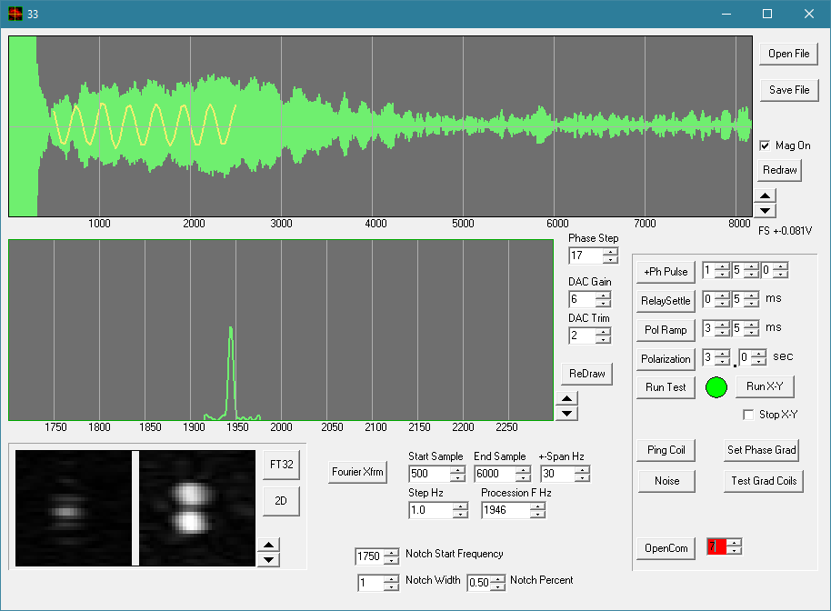

# EFMRI
Earth's Field MRI

This project outlines the use of available resources to build
an Earth's Field MRI system. It is a complex project. Aligning
and adjusting the system is a timely process. Also, the small
signal relay is no longer available. I am working on a substitute
or perhaps the addition of a second relay so a lower current 
rating small signal relay may be used.

You do not have to build the project to generate images. Data files
are supplied that can be loaded and processed with the supplied
user interface.

